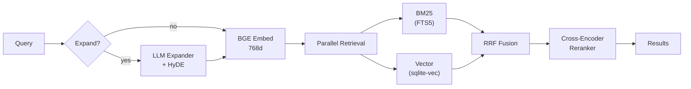
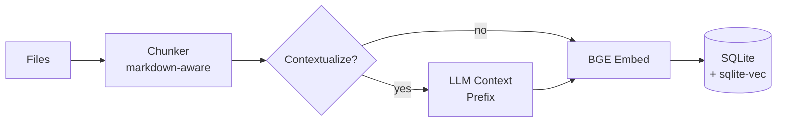
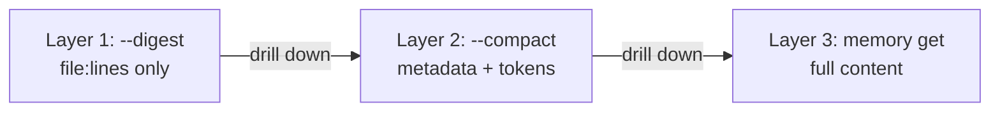

# Architecture

## Search Pipeline

## Indexing Pipeline

## Progressive Retrieval

Agents retrieve context in layers, each returning progressively more detail:

This follows the [Vercel filesystem agent pattern](https://vercel.com/blog/we-removed-80-percent-of-our-agents-tools): return only the slices of context the agent needs, rather than dumping everything into the prompt. Their approach achieved 37% fewer tokens and 3.5x faster responses.

## Components

| Component | Technology | Purpose |
|-----------|-----------|---------|
| Database | SQLite + sqlite-vec | Single-file storage, vector indexing |
| Embeddings | Cloudflare Workers AI (`bge-base-en-v1.5`, 768d) | Semantic similarity |
| Reranker | Cloudflare Workers AI (`bge-reranker-base`) | Cross-encoder scoring |
| Caching | SQLite tables | Query embeddings + reranker scores |
| Local LLM | node-llama-cpp (optional) | On-device embeddings, reranking, generation |

## Design Decisions

| Decision | Alternative | Why |
|----------|------------|-----|
| Hybrid BM25 + vector | Vector-only | BM25 catches exact keywords, error codes, proper nouns that embeddings miss |
| RRF fusion | Learned fusion | Parameter-free, works well combining ranked lists of different scales |
| Cross-encoder reranker | Bi-encoder | Scores query-document pairs together for more accurate relevance |
| SQLite single-file | Dedicated vector DB | For personal KBs (tens of thousands of chunks), sqlite-vec is fast enough — no infra complexity |
| Cloudflare Workers AI | Local models | Lightweight CLI with no GPU requirement; worker is free-tier eligible |
| Token budget control | Unbounded results | Agents can cap context cost with `--budget` to avoid filling context windows |

## Token Efficiency Architecture

memory-search is designed around a key insight from Vercel's bash-tool: **context windows fill up fast when you include large amounts of text**. The architecture provides three output tiers:

1. **`--digest`** — File references only (~10 tokens/result). Agents decide what to expand.
2. **`--compact`** — Metadata with token counts (~30 tokens/result). Agents see cost before requesting content.
3. **`--budget N`** — Hard cap. Results included until token budget exhausted.

## References

- [Anthropic — Contextual Retrieval](https://www.anthropic.com/engineering/contextual-retrieval) — hybrid BM25 + embedding + reranking reduces retrieval failure by 49%, reranker pushes to 67%
- [Anthropic — Building Effective Agents](https://www.anthropic.com/engineering/building-effective-agents) — augmented LLM pattern
- [Vercel — We removed 80% of our agent's tools](https://vercel.com/blog/we-removed-80-percent-of-our-agents-tools) — filesystem agent pattern, token reduction
- [Vercel — bash-tool](https://vercel.com/changelog/introducing-bash-tool-for-filesystem-based-context-retrieval) — filesystem-based context retrieval
- [qmd](https://github.com/tobi/qmd) by Tobi Lutke — on-device hybrid search with RRF
- [claude-mem](https://github.com/thedotmack/claude-mem) — session capture with hybrid search
